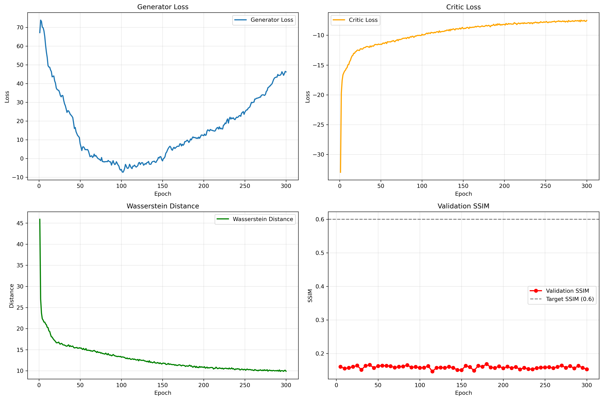

# WGAN for generating MRI scan images by Samuel Sousa Santos


## Problem: 
Medical imaging datasets tend to limit in size due to patient privacy and cost. This makes it difficult to develop a robust deep learning model. The use of a GAN (Generative Adversarial Network) addresses this issue by generating realistic medical scans. This helps by augmenting datasets and reducing data imbalance. For improved training stability, a WGAN-GP will be used.
Algorithm: There are two main parts of a GAN: the discriminator and the generator. The discriminator receives real data with the aim of learning its distribution. The generator is fed random noise as the input, with the aim of generating realistic samples. Through the process of backpropagation, the generator is optimised to reduce the difference between the real and fake data. The advantage of using a WGAN-GP is that by using Wassertein's distance formula and a penalty value for loss, it provides more meaningful gradients and ensures values are 1-Lipschitz. This is achieved by calculating how much work is needed to transform the fake distribution to the real. Hence, the feedback the generator receives is a measure of the degree by which the generated image looks 'real'.


## Dependencies
### Conda environment
conda create -n hipmri-gan python=3.13
conda activate hipmri-gan

### Install dependencies
pip install torch torchvision torchaudio
pip install numpy pillow matplotlib nibabel tqdm scikit-image

| Package      | Version |
| ------------ | ------- |
| Python       | 3.13    |
| PyTorch      | 2.4.1   |
| Torchvision  | 0.19.1  |
| NumPy        | 1.26.4  |
| Pillow       | 10.4.0  |
| Matplotlib   | 3.9.2   |
| NiBabel      | 5.2.1   |
| tqdm         | 4.66.5  |
| scikit-image | 0.24.0  |

### Reproducibility
To ensure reproducible results, the following random seeds are set:
```python
torch.manual_seed(42)
np.random.seed(42)
random.seed(42)
torch.cuda.manual_seed_all(42)
```
For complete reproducibility on GPU:
```python
torch.backends.cudnn.deterministic = True
torch.backends.cudnn.benchmark = False
```

## Example Inputs, Outputs, and Visualizations

### Input Data Format

The model accepts 2D MRI slices extracted from NIfTI (.nii.gz) files:

**Input specifications**:
- **Format**: NIfTI medical imaging format (.nii, .nii.gz)
- **Dimensions**: Variable (automatically resized to 128×128)
- **Intensity range**: Normalized to [-1, 1]
- **Modality**: T2-weighted prostate MRI scans

**Example input file structure**:
case_013_week_5_slice_44.nii.gz


### Outputs/Plots

The model tracks four key metrics during training:



**Figure 1**: Training progression over 300 epochs showing:
- **Top-left**: Generator Loss (decreasing indicates better fake images)
- **Top-right**: Critic Loss (measures real vs fake discrimination)
- **Bottom-left**: Wasserstein Distance (convergence metric)
- **Bottom-right**: Validation SSIM (image quality metric, target ≥ 0.6)

As shown in the bottom right plot, the model did not reach the desired SSIM.


### Images generated at different training stages:

| Epoch | Sample Images | Quality |
|-------|---------------|---------|
| **Epoch 0** |  | Random noise |
| **Epoch 50** |  | Basic shapes visible |
| **Epoch 150** | 
| **Epoch 300** | 


## Data Preprocessing
All preprocessing is performed in `dataset.py` using the `HipMRIDataset` class, which handles NIfTI medical imaging files and prepares them for GAN training.

### Intensity Normalization
```python
# Normalize to [0, 255] range
img_array = img_array.astype(np.float32)
if img_array.max() > 0:
    img_array = (img_array - img_array.min()) / (img_array.max() - img_array.min())
img_array = (img_array * 255).astype(np.uint8)

- MRI scans have varying intensity ranges due to different scanner settings
- Prevents any single scan from dominating the learning process

**Reference**:
- Nyúl & Udupa (1999) - "On Standardizing the MR Image Intensity Scale"

### Spatial Resizing
```python
# Resize to 128×128 using bilinear interpolation
img = img.resize((128, 128), Image.BILINEAR)
```

- Original NIfTI files have variable dimensions
- 128×128 is computationally efficient while preserving anatomical detail
- Bilinear interpolation maintains smooth tissue boundaries


### Final Normalization to [-1, 1]
```python
# Convert to [0, 1] then [-1, 1]
img_array = np.array(img, dtype=np.float32) / 255.0
img_tensor = (img_tensor - 0.5) / 0.5  # Maps [0,1] → [-1,1]
```

- `Tanh()` outputs values in [-1, 1]
- Training is more stable when real and fake images have the same range
- Standard practice in GAN implementations

**Reference**:
- Goodfellow et al. (2014) - Original GAN paper
- Radford et al. (2015) - DCGAN architecture guidelines


### Data Augmentation (Training Only)

To increase dataset diversity and improve generalization, augmentation is applied **only to the training set**:

#### Augmentation Techniques

| Technique | Probability | Range | Justification |
|-----------|-------------|-------|---------------|
| **Horizontal Flip** | 50% | - | Prostate anatomy is roughly symmetric |
| **Vertical Flip** | 30% | - | Less common but anatomically valid |
| **Rotation** | 70% | ±15° | Accounts for patient positioning variations |
| **Brightness** | 70% | 0.85-1.15× | Simulates scanner intensity variations |
| **Contrast** | 70% | 0.85-1.15× | Mimics different tissue contrast settings |
| **Sharpness** | 50% | 0.8-1.2× | Represents image quality variations |
| **Translation** | 50% | ±10% | Accounts for slice positioning differences |

- **Conservative ranges**: Medical images require anatomically plausible transformations
- **No extreme augmentation**: Preserves diagnostic features
- **Training only**: Validation/test sets remain unmodified for fair evaluation

**References**:
- Shorten & Khoshgoftaar (2019) - "A survey on Image Data Augmentation for Deep Learning"
- Perez & Wang (2017) - "The Effectiveness of Data Augmentation in Image Classification"


## Data Split 

The dataset provived had been split ahead of time into three subsets:

| Split | Files | Slices | Percentage | Purpose |
|-------|-------|--------|------------|---------|
| **Training** | - | 11,460 | 91.2% | Model learning |
| **Validation** | - | 660 | 5.2% | Hyperparameter tuning |
| **Test** | - | 540 | 4.3% | Final evaluation |
| **Total** | - | 12,660 | 100% | - |

**Advantages of pre-split data**:
- Ensures no data leakage between sets
- Consistent evaluation across different implementations
- Patient-level separation (patients don't appear in multiple splits)
- Reproducible results across studies

### Training Set
- GANs require large amounts of data to learn complex distributions
- More training data → better generator quality
- Reduces overfitting by providing diverse examples

### Validation Set
- Monitor training progress without overfitting
- Select best model checkpoint based on SSIM metric
- Tune hyperparameters (learning rates, architecture choices)

### Test Set
- Provides unbiased estimate of generalization
- Never used during training or hyperparameter selection
- Ensures reported SSIM scores reflect true performance

